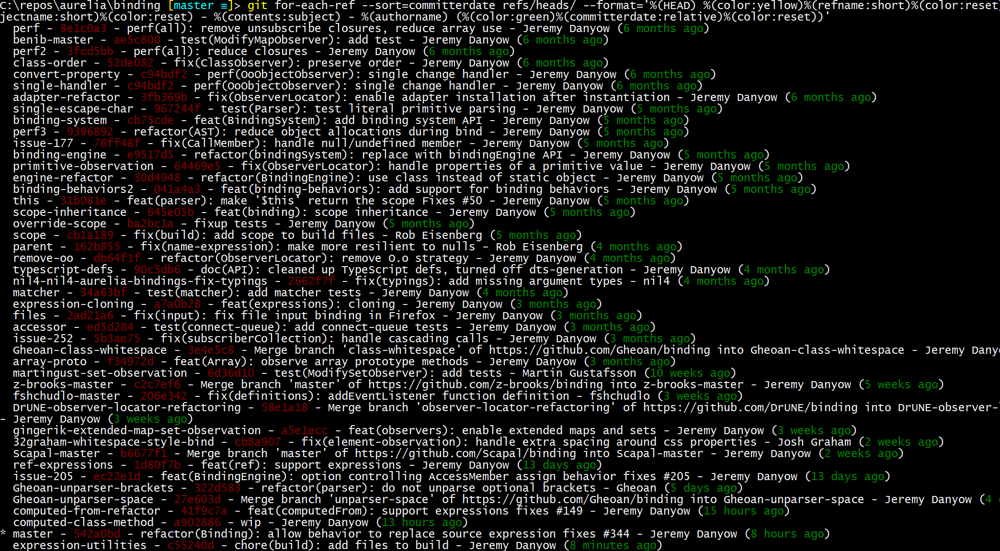

# sort-branch

A small script that prints your git branches in a useful way

[stack overflow](https://stackoverflow.com/questions/5188320/how-can-i-get-a-list-of-git-branches-ordered-by-most-recent-commit) has a variety of opinions on how you can achieve this. I like this implementation the best

## Installation

```bash
npm i -g sort-branch
```

## Use

```bash
sort-branch
```

Output

